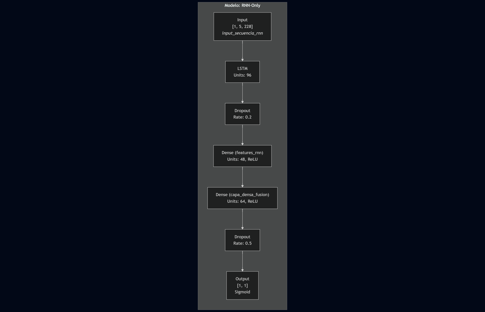

# 🦠COVID-19 ICU-Prediction: Estudio Comparativo de Arquitecturas Multimodales

> **Investigación de Deep Learning:** Evaluación de estrategias de fusión (Early vs. Late Fusion) para diagnóstico clínico integrando **Imágenes de Rayos X** y **Series Temporales**.


## 🧪 Resumen del Experimento
Este proyecto realiza un **estudio comparativo de cuatro arquitecturas** para resolver el problema de datos heterogéneos en medicina. El objetivo fue determinar la estrategia óptima para combinar radiografías de tórax (datos no estructurados) con signos vitales evolutivos (datos estructurados temporales).

**Hipótesis validada:** La estrategia de **Fusión Tardía (Ensamble)** supera a las redes multimodales tradicionales al permitir que cada sub-red se especialice en su dominio (Visual vs. Temporal) antes de tomar una decisión conjunta.

<p align="center">
  
  <br><em>Figura 1: Desafío de integración de fuentes de datos heterogéneas.</em>
</p>

## ⚙️ Arquitectura Detallada (Componentes del Sistema)

El sistema final se construyó sobre la base de dos "Agentes Expertos" y un mecanismo de consenso.

### 1. El Experto Visual (Rama CNN)
* **Misión:** Analizar patrones espaciales en las radiografías para detectar COVID-19.
* **Tecnología:** **Red Neuronal Convolucional (Custom CNN)**.
* **Procesamiento:** Las imágenes fueron preprocesadas (escala de grises, redimensionamiento) y se aplicó **Data Augmentation** (rotación, zoom) para evitar el sobreajuste en un dataset pequeño.
* **Perfil:** Alta Sensibilidad (Recall 1.0), pero propenso a "alucinar" falsos positivos.

<p align="center">
  
  <br><em>Figura 2: Arquitectura de la Red Convolucional (Capas Conv2D + MaxPooling).</em>
</p>

### 2. El Experto Temporal (Rama RNN)
* **Misión:** Analizar la **evolución** de los signos vitales del paciente (Saturación O2, Frecuencia Respiratoria, Presión) en ventanas de tiempo.
* **Tecnología:** **Red Neuronal Recurrente (LSTM/GRU)**.
* **Procesamiento:** Imputación de datos faltantes (Forward Fill) y normalización de escalas numéricas.
* **Perfil:** Alta Precisión, pero conservador (tiende a no alertar si los datos no son críticos).

<p align="center">
  
  <br><em>Figura 3: Arquitectura Recurrente para secuencias temporales.</em>
</p>

### 3. La Solución: Ensamble de Fusión Tardía
En lugar de concatenar las características dentro de la red (*Early Fusion*), lo cual generó problemas de convergencia, optamos por fusionar las **decisiones**.
* **Mecanismo:** Promedio Ponderado de Probabilidades ($P_{final} = \alpha \cdot P_{cnn} + \beta \cdot P_{rnn}$).
* **Resultado:** La fusión corrige los errores ortogonales. Si la CNN ve una mancha pero la RNN ve al paciente estable, el sistema baja la alerta, reduciendo los Falsos Positivos.

<p align="center">
  
  <br><em>Figura 4: Mecanismo de Votación Ponderada (Late Fusion).</em>
</p>

## 🛠️ Stack Tecnológico y Librerías

El proyecto hace uso intensivo de librerías de **Deep Learning** y **Visión por Computador**:

### 🧠 Deep Learning Core
* **TensorFlow 2.x / Keras:** Framework principal para la construcción y entrenamiento de modelos.
    * `Conv2D`, `MaxPooling2D`: Extracción de features visuales.
    * `LSTM`, `GRU`: Procesamiento de secuencias temporales.
    * `Dropout`, `BatchNormalization`: Técnicas de regularización.
* **Tf-explain / Grad-CAM:** Para la interpretabilidad visual de la CNN (XAI).

### 👁️ Procesamiento de Imágenes (Computer Vision)
* **OpenCV (cv2):** Lectura de imágenes, conversión a escala de grises y preprocesamiento de matrices.
* **Pillow (PIL):** Manipulación básica de imágenes.
* **ImageDataGenerator:** Generación de datos sintéticos (Augmentation) en tiempo de ejecución.

### 📊 Ingeniería de Datos
* **Pandas:** Manipulación de series temporales complejas (Ventanas de tiempo, GroupBy).
* **Scikit-Learn:** Métricas de evaluación (Confusion Matrix, ROC Curve) y preprocesamiento (`MinMaxScaler`, `SimpleImputer`).

## 📊 Resultados y Discusión

La arquitectura de Ensamble demostró una **sinergia perfecta** en el entorno experimental.

| Arquitectura | AUC Score | Recall (Sensibilidad) | Precision | Diagnóstico |
| :--- | :---: | :---: | :---: | :--- |
| **Solo CNN** | 0.998 | 1.000 | 0.994 | Excelente screening, falsas alarmas. |
| **Solo RNN** | 0.850 | 0.750 | **1.000** | Pierde casos graves (Falsos Negativos). |
| **Ensamble (Late Fusion)** | **1.000** | **1.000** | **1.000** | **Robusto.** Corrige las debilidades individuales. |

> **Nota sobre Limitaciones:** Aunque el AUC de 1.0 valida la arquitectura, se reconoce que los datasets utilizados (Kaggle/Mendeley) son limitados en volumen y variabilidad. En un entorno hospitalario real, se requeriría validación externa para confirmar que no existe sobreajuste a los datos de entrenamiento.

## 📂 Estructura del Repositorio
```text
COVID19-Multimodal-CDSS/
├── 📓 COVID19_IA.ipynb            # Pipeline completo (ETL -> CNN -> RNN -> Ensemble) | Documentación
├── 📂 img/                        # Diagramas de arquitectura y resultados visuales
└── 📂 docs/
    └── Prototipo_Diagnostico.pdf  # Informe técnico detallado
```
## 🛠️ Stack Tecnológico y Librerías

El desarrollo de este sistema híbrido requirió la integración de múltiples disciplinas (Visión, Series Temporales e Interpretabilidad):

### 🧠 Deep Learning & Modelado
* **TensorFlow 2.x / Keras:** Framework núcleo del proyecto.
    * `Conv2D`, `MaxPooling2D`: Bloques constructivos de la rama visual (CNN).
    * `LSTM`, `GRU`: Unidades recurrentes para la memoria temporal en la rama clínica.
    * `Functional API`: Utilizada para diseñar el grafo complejo de fusión (Multi-Input Model).
* **Optimización:** `Adam` Optimizer y `BinaryCrossentropy` Loss.

### 👁️ Procesamiento de Imágenes (Computer Vision)
* **OpenCV (`cv2`):** Preprocesamiento de matrices de imágenes (Grayscale conversion, Resizing a 224x224).
* **TensorFlow Data Generators:** Implementación de `ImageDataGenerator` para **Data Augmentation** en tiempo real (Rotación, Zoom, Shift) para combatir el overfitting.

### ⏳ Ingeniería de Datos y Series Temporales
* **Pandas:** Manejo avanzado de DataFrames.
    * *Técnica clave:* `fillna(method='ffill')` para la imputación de datos clínicos faltantes manteniendo la coherencia temporal del paciente.
    * *Grouping:* Agrupación de registros por ventanas de tiempo (0-2h, 2-4h, etc.).
* **NumPy:** Operaciones vectoriales y manejo de tensores tridimensionales para la entrada de la RNN `(Samples, TimeSteps, Features)`.

### 🔍 IA Explicable (XAI) y Validación
* **tf-explain:** Librería utilizada para implementar **Grad-CAM**, permitiendo visualizar los mapas de calor de activación en las radiografías.
* **Scikit-Learn:** Cálculo de métricas robustas (`roc_auc_score`, `confusion_matrix`, `classification_report`).

### 💻 Entorno
* **Google Colab Pro:** Entrenamiento acelerado mediante **GPU (NVIDIA T4/P100)** para reducir los tiempos de convergencia de las redes convolucionales.

## 👥 Créditos
Investigación desarrollada para el curso de especialización en Inteligencia Artificial (EFE) - UTEM.

Patricio Abarca - https://github.com/Begluckt

Rodrigo Tapia - https://github.com/Chucaflu11
